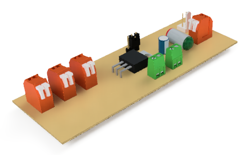

# RADIAL-V
## Alimentation Board

Cette carte est alimentée par l’alimentation générale. Elle répartit l’alimentation vers les différents composants:
* Carte Arduino Master (5v)
* Carte Arduino Slave (5v)
* Carte Audio Board: Pré-Ampli et Ampli (12v)
* Lampes de la face avant (5v)

[Vue du modèle 3D](Radial-V%20Alim%20Board.stl)

