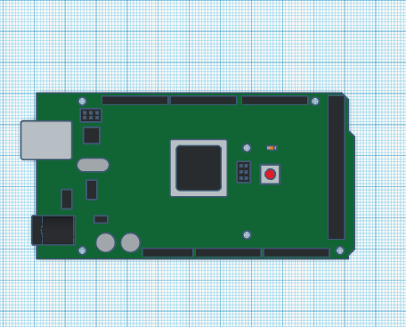

# RADIAL-V
## Arduino Mega

Le système comporte deux cartes Arduino Mega: ARD1 (Master) et ARD2 (Slave).

* ARD1: utilise 19 I/O (dont 6 avec interruption) ce qui nécessite un Mega.
* ARD2: consomme 2 à 3 kB de RAM, ce qui nécessite un Mega.

Les deux Arduino communiquent en I2C.

[Vue du modèle 3D](Arduino_Mega_2560.stl)

