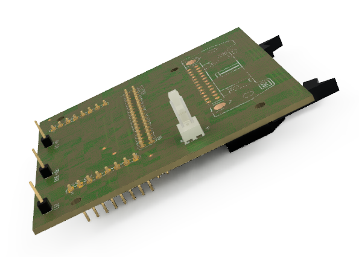

# RADIAL-V
## Bus Board (version 1)

La carte Bus collecte les différents E/S utiles de l’Arduino, et les envoie sur une nappe de 25 points vers la carte Extension. 
Cette carte se plugge directement sur l’Arduino Master.

_Note: Sur la version 1, trois connexions (3V3, D3 et RST) sont mal positionnées et gênent la carte MP3._

[Vue du modèle 3D](Radial-V-Bus-Board-v1.stl)

