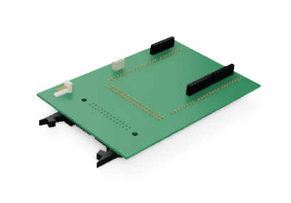

# RADIAL-V

## 3D model : Bus Board v2

La carte Bus Board regroupe 25 pins de la carte Arduino Mega sur une nappe 25 points.

### V2: La nouvelle version de la Bus Board.

La carte est un peu plus grande, mais l'encombrement devrait etre diminué car les fils "volants" alentours sont devenus des pistes sur la carte (en particulier, le Reset et le Bus SPI vers la carte MP3).

[Vue du modèle 3D](Radial-V-Bus-Board-v2.stl)

