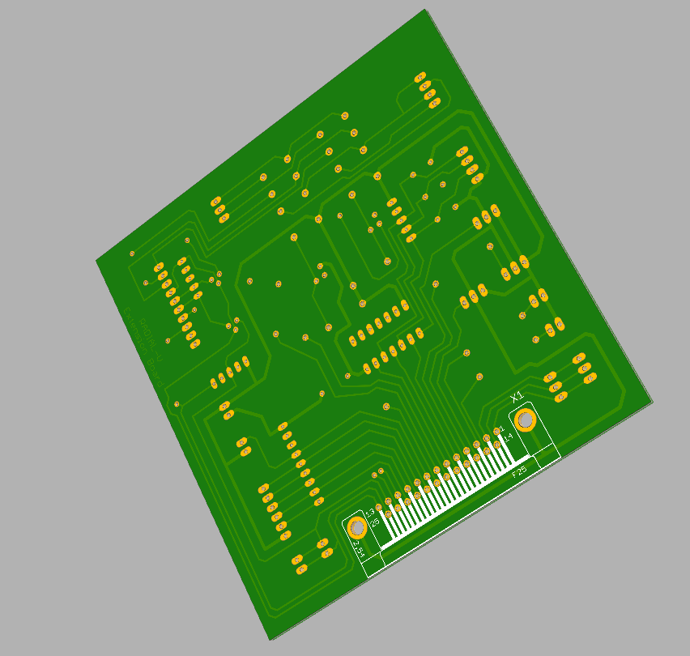
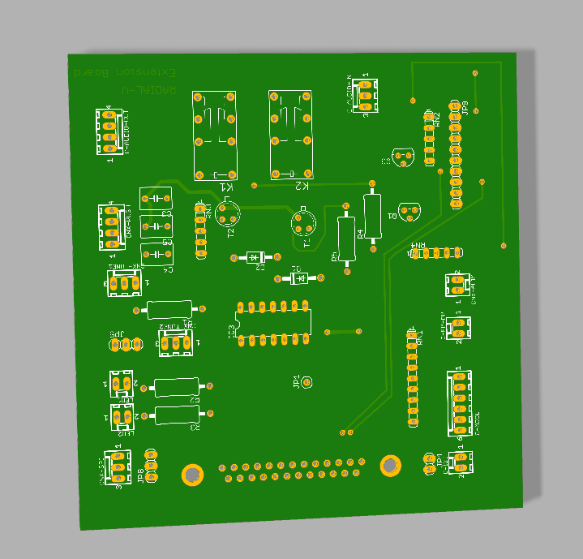

# RADIAL-V
## Extension Board

Cette carte comporte des connecteurs d’entrée/sortie pour les différents capteurs de l’Arduino (boutons, Leds, ...) 
avec leurs adaptations, et pilote les relais pour la sélection de l'audio 
(Audio issue de la carte MP3, ou de la carte Radio-FM).

[Vue du modèle 3D](Radial-V-ExtensionBoard.stl)

