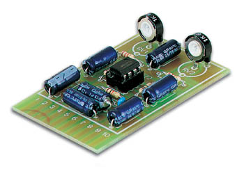

# RADIAL-V

## Pré-Amplificateur audio

Kit Pré-Amplificateur Audio Stéréo **Velleman K2572**, alimenté en 12v. Gain de +40db.



Le dossier contient la documentation relative à cette carte, aussi disponible sur le site du fabriquant [Velleman](https://www.velleman.eu/products/view/?country=fr&lang=fr&id=8982).

```
1. GND
2. Audio OUT LEFT
3. GND
4. Audio IN LEFT
5. 0v (alimentation)
6. +12v (alimentation de 10v à 30v DC)
7. Audio IN RIGHT
8. GND
9. Audio OUT RIGHT
10. GND
```
Les blindages des fils de connexion se soudent aux masses qui se trouvent à coté des Entrées et Sorties.
N'utiliser que des fils blindés, et les plus courts possibles.

Les amplitudes des canaux de sortie sont réglables independamment par les Résistances Variables RV1 et RV2.

Une alimentation non correctement stabilisée aura pour résultat du bruit de fond et des ronflements.
