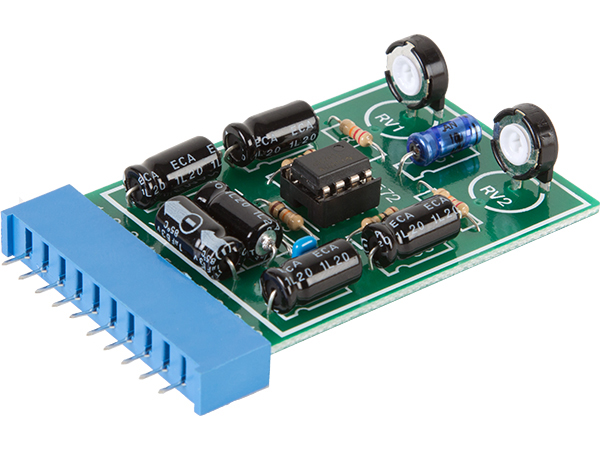

# RADIAL-V

## Pré-Amplificateur audio

Kit Pré-Amplificateur Audio Stéréo **Velleman K2572**, alimenté en 12v. Gain de +40db.

Le dossier contient la documentation relative à cette carte, aussi disponible sur le site du fabriquant [Velleman](https://www.velleman.eu/products/view/?country=fr&lang=fr&id=8982).

