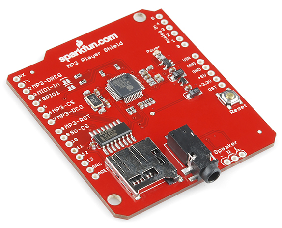

# RADIAL-V

## Sparkfun MP3 Player Shield v1.3 (RETIRED)

Le Player MP3 de Sparkfun est un shield pour Arduino, piloté en SPI, comprenant une carte SD pour stocker les fichiers MP3 et un chipset audio pour les jouer. La sortie audio se fait sur une prise Jack et/ou un connecteur "Speaker".

## Liens utiles

[learn.sparkfun.com : MP3 Player Shield Hookup Guide V15](https://learn.sparkfun.com/tutorials/mp3-player-shield-hookup-guide-v15)

[SparkFun MP3 Player Shield - DEV-10628 - SparkFun Electronics](https://www.sparkfun.com/products/retired/10628)

## Dossiers

* **/Documentation** - PDF contenant toute la documentation de cette carte.
* **/Pictures** - Images de la carte
* **/Plug-in for VSLI** - Le chipset a besoin d'être patché avec ces fichiers binaires, qui contiennent quelques correctifs du fabriquant.
* **/Sparkfun Repository** - Le repository GitHub de la carte, contenant essentiellement son schéma électronique, et quelques exemples de code.
