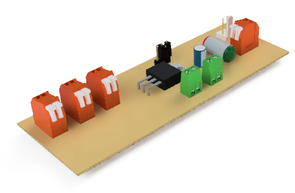
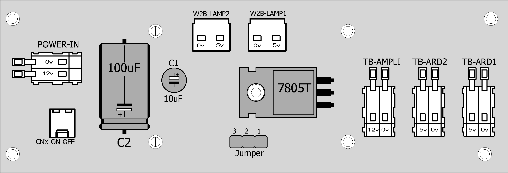

# RADIAL-V

## Alimentation Board

Cette carte distribue l'alimentation **5v** vers les autres cartes du système et le **12v** vers les amplicateurs audios.

### Les Entrées:
* POWER-IN : Alimentation externe 12v (VCC)
* CNX_ON_OFF : Bouton ON/OFF externe
* Jumper: Permet d’alimenter les Arduino en VCC (12v) ou en +5v

## Schematic & PCB

Compatibles avec le logiciel **Eagle**.
