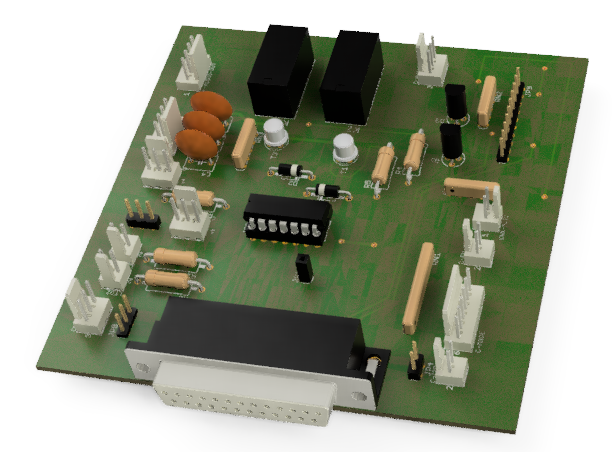
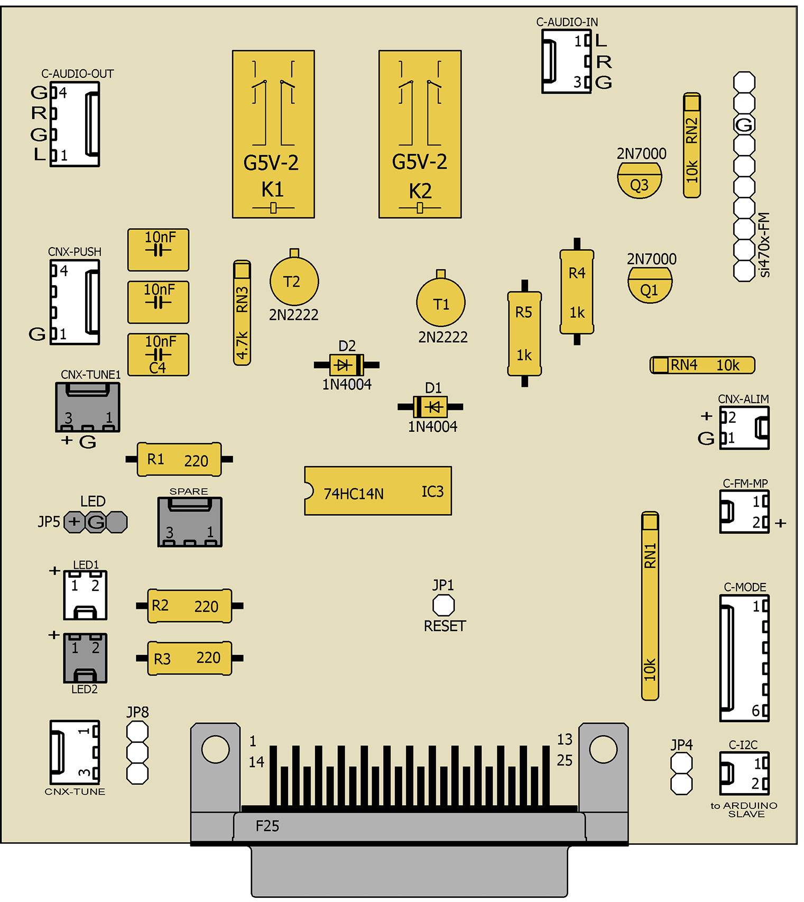

# RADIAL-V

## Extension Board

Cette carte regroupe tous les capteurs et actuateurs (boutons, LEDs, etc) du système et les envoie sur une nappe 25 fils vers l'Arduino.

Le circuit intégré 74HC14 est un *trigger de Schmitt inversé* qui, associé aux capacités, supprime les rebonds des boutons poussoirs, et transforme les impulsions en signaux carrés propres inversés (*active high*).
Les relais servent à commuter le signal audio de sortie soit de la source "Carte MP3", soit de la source "Carte radio FM".
