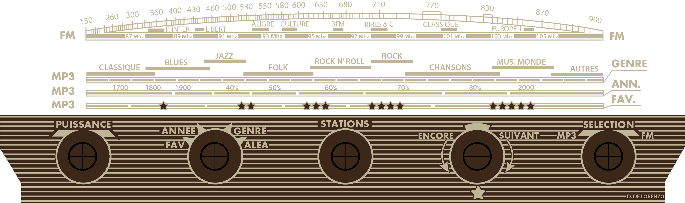

# RADIAL-V

## Façade Plexiglass

La face-avant de la radio est refaite, en gardant le design de la face-avant originale, mais en affichant des graduations adaptées aux nouvelles fonctionnalités du Radial-V.

 

## Fabrication

### Génération du .psd à partir du .ai

- Dans Illutratrator, exporter un fichier **.psd** avec les layers et sans lissage.
  (Dessin sans les hachures, et sans tracé du contour de découpe). 
- Ouvrir le fichier dans Photoshop: Dans le calque "fond brun", effacer le hachurage vert.
- Exporter en PNG avec couche Alpha.
  (**blanc = transparent**)
- Enregistrer
  

Dimensions : 303 x 93 mm