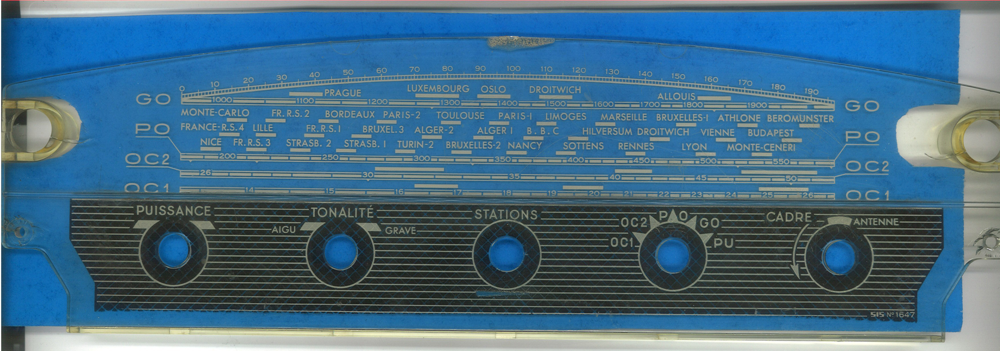

# RADIAL-V

## Façade Plexiglass

La face-avant de la radio est refaite, en gardant le design de la face-avant orginale, mais en affichant des graduations adaptées aux nouvelles fonctionnalités du Radial-V.

 

## Fabrication

### Génération du .psd à partir du .ai

- Generer un fichier **.ai** sans les hachures
- Ouvrir le fichier dans photoshop, le sauvegarder en **.psd**
- Ajuster quelques glitchs autour du bouton **puissance**
- Ajuster quelques glitchs autour du libellé **stations**
- Renommer le layer en **colors**

- Afficher les couches
- Ajouter une couche (elle se nommera automatiquement **alpha**)
- coller dans cette couche le masque (tel que préparé dans le psd v10)
  (**blanc = transparent**)
  
- Ne pas imprimer le tracé de contour (contour de découpe).
  Il sera plus exact de faire le tracé de la découpe à partir de l'original, sur le plexi final.

Dimensions : 303 x 93 cm