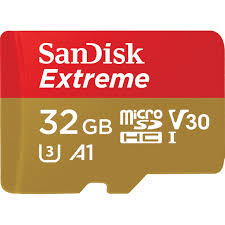

# RADIAL-V

## SD Card MP3

* **/Preparation** - Ce repository contient les éléments nécessaires pour la carte SD du shield **MP3 Player**:
  * Fichiers audio utilisés par le programme (`NOISE.MP3` et `STARTER.MP3`)
  * Scripts et utilitaires pour générer le fichier `Catalog.ndx` utilisé par le programme.

* **/SD_Card** - Contenu typique de la carte SD: le fichier `Catalog.ndx` et un repertoire `Music`contenant tous les fichiers MP3 au format 8.3 

  

