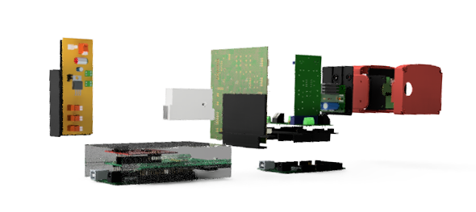
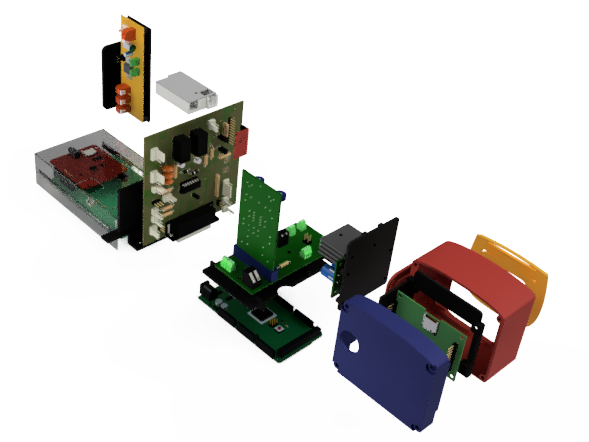

# Radial-V

Modelisation of all elements built for this project, positioned at their final place.

Some are 3D-models for the PLA printed supports, electronic boards  and homemade PCBs.

Front view:

Rear view:

Perspective:

**[Back to home page](../index)**

