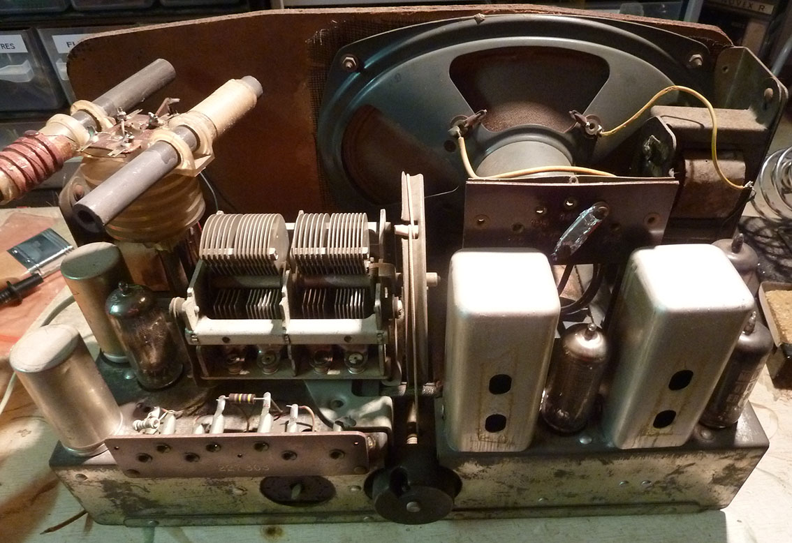
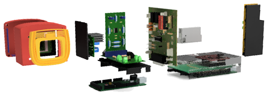

# Radial-V

## Présentation

Remise en fonctionnement d'un poste de TSF, avec radio FM, player MP3, et afficheur LCD.

## Fabrication

Plusieurs éléments ont été réalisés: logiciel, circuits électroniques et supports en PLA.

