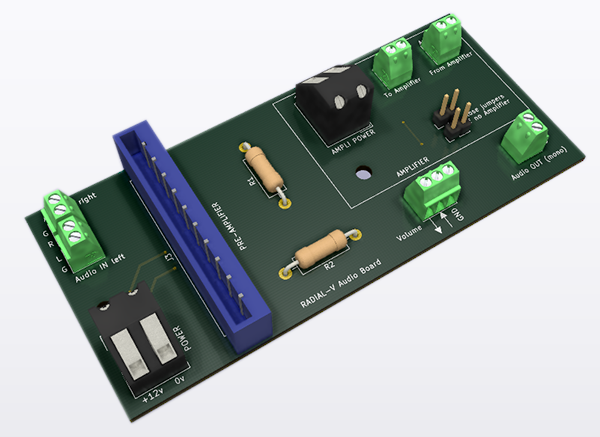
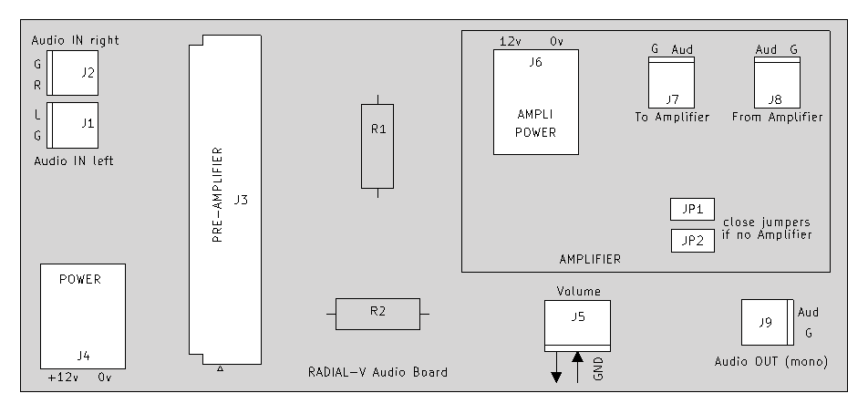

# Radial-V

## Carte "Audio-Board"

Cette carte fait passer la sortie audio (en provenance de la carte "Extension Bus") par un Pré-Amplificateur, le potentiomètre de volume, et un Amplificateur mono. Le haut-parleur (4 ou 8 ohms) peut être branché directement sur "Audio OUT".

### Schéma d'implémentation

