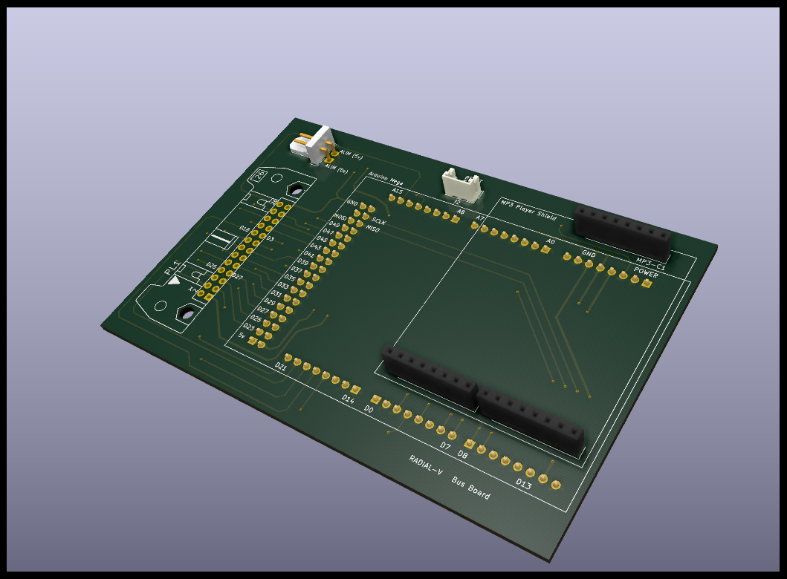
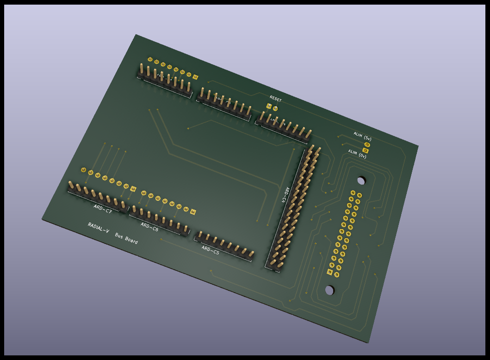
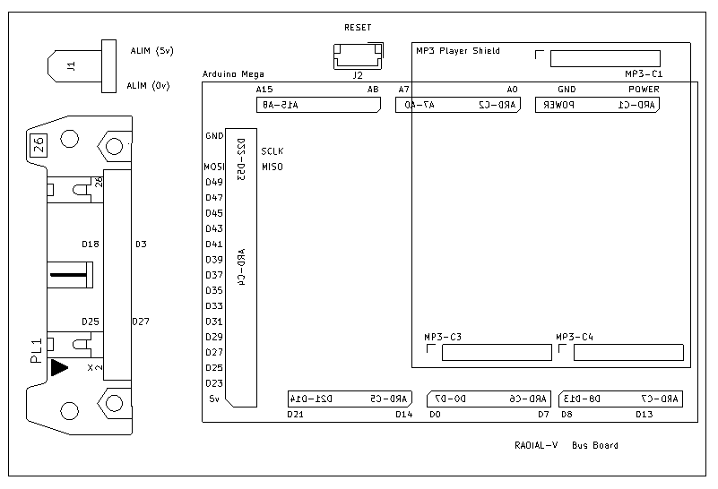

# Radial-V

## Carte "Bus-Board"

Cette carte rassemble toutes les pins d'entrées/sorties utilisées de l'Arduino, vers une nappe 25 points, qui conduit à la carte "Extension Board". On plugge aussi dessus la carte "Sparkfun MP3 player".

### Schéma d'implémentation

