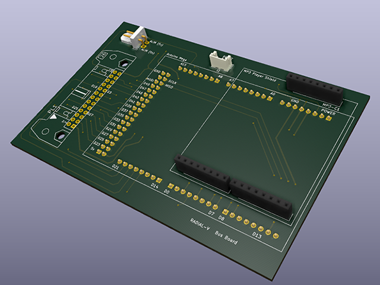
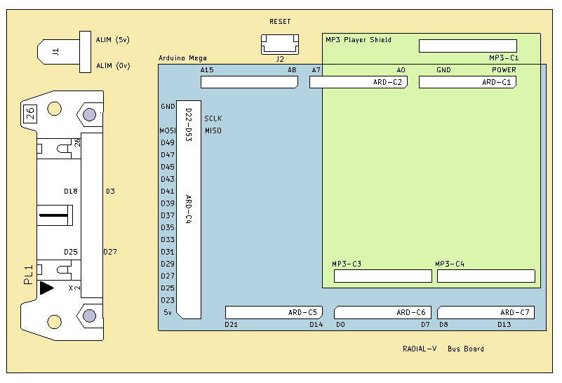

# Radial-V

## Carte "Bus-Board"

Cette carte Rassemble toutes les entrées/sorties utilisées depsui les pins de l'Arduino vers une nappe 25 points, qui conduit à la carte "Extension Board". On plugge aussi dessus la carte "Sparkfun MP3 player".

### Schéma d'implémentation

